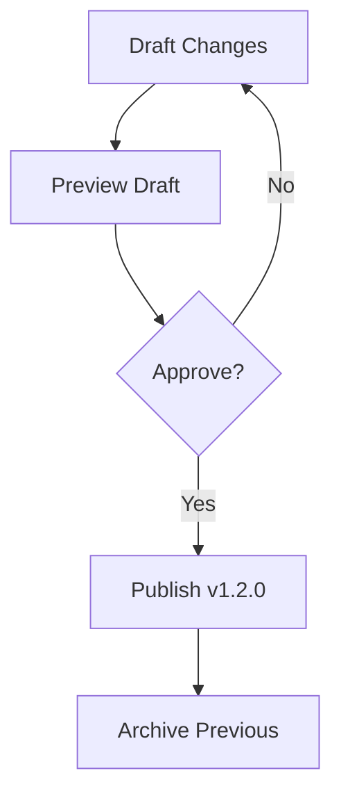

## Document Organization

Lorenzo Otieno Documentation provides flexible ways to structure your project docs. You organize content into folders, pages, and nested hierarchies for intuitive navigation.

<Columns cols={3}>
  <Card title="Folders" icon="folder" href="#">
    Group related pages into folders. Create subfolders for deep hierarchies like `guides/advanced/`.
  </Card>
  <Card title="Frontmatter" icon="file-text" href="#">
    Add YAML frontmatter to pages for metadata like `title` and `description`.
  </Card>
  <Card title="Navigation" icon="menu" href="#">
    Auto-generate sidebars from folder structure for seamless browsing.
  </Card>
</Columns>

Use a clear folder structure from the start:

<Steps>
  <Step title="Create Root Folders" icon="folder-plus">
    Set up top-level folders like `core-concepts/`, `guides/`, and `api/`.
  </Step>
  <Step title="Add Pages" icon="file-plus">
    Create `.mdx` files inside folders with proper frontmatter.
  </Step>
  <Step title="Link Pages" icon="link">
    Use relative links like `[Guides](/guides/intro)` for navigation.
  </Step>
</Steps>

## Collaboration Features

Collaborate with your team using built-in tools. Invite members, assign roles, and track changes in real-time.

<Tabs>
  <Tab title="Team Invites" icon="users">
    Send invites via email or link. Set roles: Admin, Editor, Viewer.

    ```bash
    # Example invite command (CLI)
    lorenzo invite team@example.com --role=editor
    ```
  </Tab>
  <Tab title="Comments" icon="message-circle">
    Add inline comments on pages. Resolve threads as you review.

    <Callout kind="tip">
      Use `@mentions` like `@john` to notify teammates directly.
    </Callout>
  </Tab>
  <Tab title="Real-time Edits" icon="edit-3">
    Multiple users edit simultaneously with live previews and conflict resolution.
  </Tab>
</Tabs>

## Versioning Basics

Version your documentation to maintain history and publish updates safely. Use semantic versioning and draft previews.

<CodeGroup tabs="Git Integration,Built-in Drafts">
  ```bash
  # Git-based versioning
  git add docs/core-concepts.mdx
  git commit -m "Update collaboration section"
  git push origin main
  ```
  ```yaml
  # Draft frontmatter example
  ---
  title: Core Concepts (Draft)
  draft: true
  version: "1.2.0"
  ---
  ```
</CodeGroup>

| Feature | Git Integration | Built-in Drafts |
|---------|-----------------|-----------------|
| History | Full commit log | Page-level snapshots |
| Previews | Branch previews | Live draft URLs |
| Rollback | `git revert` | One-click restore |

<Expandable title="Advanced Versioning Workflow" default-open="false">



Tag releases with changelogs for transparency.

</Expandable>

<Callout kind="info">
  Enable versioning in project settings to unlock draft previews and rollback.
</Callout>