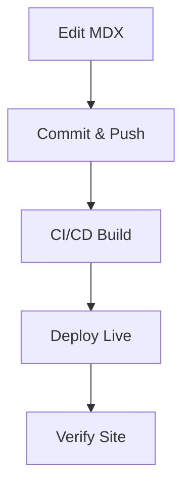

## Overview

Lorenzo Otieno Documentation provides a flexible space to organize your project docs. You create pages, structure folders, and publish updates efficiently. Follow these guides to maintain clear, accessible documentation.

<Columns cols={3}>
  <Card title="Create Pages" icon="file-plus" href="#">
    Build new MDX pages quickly.
  </Card>
  <Card title="Folder Structures" icon="folder" href="#">
    Organize content logically.
  </Card>
  <Card title="Publishing" icon="upload-cloud" href="#">
    Deploy changes seamlessly.
  </Card>
</Columns>

## Creating and Editing Pages

Start by creating new MDX files in your docs directory. Use your preferred editor to add frontmatter, headings, and components.

<Steps>
  <Step title="Create New File" icon="file-plus">
    Navigate to the `docs/` folder and create `new-page.mdx`.

    ```bash
    mkdir -p docs/guides
    touch docs/guides/quickstart.mdx
    ```
  </Step>
  <Step title="Add Frontmatter" icon="edit-3">
    Insert YAML frontmatter at the top.

    ```mdx
    ---
    title: Quickstart Guide
    description: Get started with Lorenzo Otieno.
    ---
    ```
  </Step>
  <Step title="Write Content" icon="pen-tool">
    Add H2 headings and components. Start with `## Overview`.

    <Callout kind="tip">
      Always escape special characters like `{variable}` and `<Component>` with backticks in prose.
    </Callout>
  </Step>
  <Step title="Preview Changes" icon="eye">
    Use `npm run dev` to preview locally.

    ```bash
    npm run dev
    ```
  </Step>
</Steps>

## Organizing Folder Structures

Structure your docs hierarchically for easy navigation. Use folders for categories like `guides/`, `api/`, and `reference/`.

<Tabs>
  <Tab title="Simple Project" icon="folder">
    Flat structure for small projects.

    ```plaintext
    docs/
    ├── intro.mdx
    ├── quickstart.mdx
    └── changelog.mdx
    ```
  </Tab>
  <Tab title="Complex Project" icon="layers">
    Nested folders for larger docs.

    ```plaintext
    docs/
    ├── introduction/
    │   └── overview.mdx
    ├── guides/
    │   ├── installation.mdx
    │   └── deployment.mdx
    └── api/
        ├── endpoints.mdx
        └── authentication.mdx
    ```
  </Tab>
  <Tab title="Versioned Docs" icon="git-branch">
    Maintain versions with branches.

    ```plaintext
    docs/
    ├── v1/
    │   └── reference.mdx
    ├── v2/
    │   └── reference.mdx
    └── current.mdx
    ```
  </Tab>
</Tabs>

<Callout kind="info">
  Limit nesting to 3 levels to avoid deep navigation paths.
</Callout>

## Publishing Workflows

Publish updates via Git and your hosting platform. Automate with CI/CD for consistency.

<Steps>
  <Step title="Commit Changes" icon="git-commit">
    Stage and commit your MDX files.

    ```bash
    git add docs/
    git commit -m "Add quickstart guide"
    ```
  </Step>
  <Step title="Push to Remote" icon="git-pull-request">
    Push to your repository.

    ```bash
    git push origin main
    ```
  </Step>
  <Step title="Deploy Automatically" icon="rocket">
    Your platform deploys on push. Monitor the build logs.
  </Step>
</Steps>



<Expandable title="Advanced Publishing Tips" default-open="false">
  Integrate webhooks for instant previews. Use environment variables like `{NEXT_PUBLIC_API_URL}` in code blocks.

  | Workflow | Tool | Benefit |
  |----------|------|---------|
  | Manual | GitHub Pages | Simple setup |
  | Automated | Vercel/Netlify | Fast deploys |
  | Preview | Pull Requests | Team review |
</Expandable>

Maintain your docs regularly to keep them current and user-friendly.